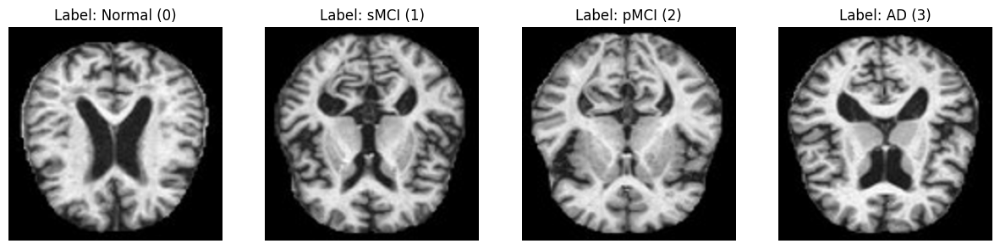
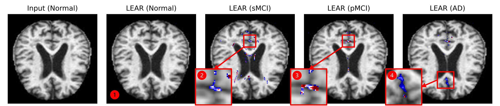
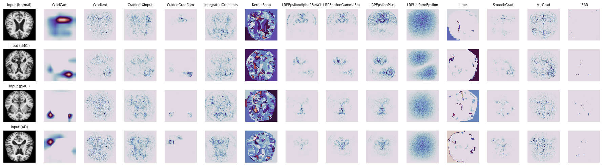
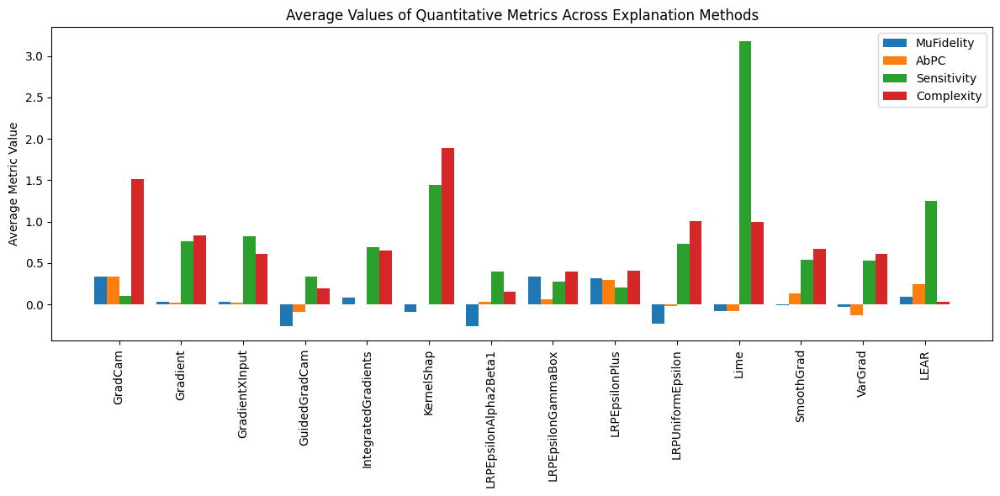

# Medical Image Classification with PnPXAI

In this notebook, we demonstrate the use of the PnPXAI library for explaining a ResNet-based image classification model on the ADNI (Alzheimer's Disease Neuroimaging Initiative) dataset.

**Contents:**
1. [Setup](#setup)
    - [Clone PnPXAI repository and install dependencies](#clone-install)
2. [Loading Data and Model](#data-model)
    - [Load ADNI Dataset](#load-data)
    - [Load Pre-trained ResNet Model](#load-model)
3. [Explanation Using PnPXAI](#explanation)
    - [Add the LEAR Explainer](#lear-explainer)
    - [Generate Explanations](#generate-explanations)
4. [Visualization](#visualization)
    - [Visualize Original Images and Explanations](#visualize-images)
5. [Evaluation of Explanations](#evaluation)
    - [MuFidelity](#mufidelity)
    - [Sensitivity](#sensitivity)
    - [Complexity](#complexity)

This example demonstrates how PnPXAI can be used to gain insights into the decision-making process of a medical image classification model, specifically for Alzheimer's disease classification.


## 1. Setup<a name="setup"></a>

First, we clone the PnPXAI repository and install the required dependencies.


```python
!git clone --quiet https://github.com/OpenXAIProject/pnpxai
!pip install -q -e /content/pnpxai
!pip install -q datasets

import sys
sys.path.append('/content/pnpxai')
```


```python
import matplotlib.pyplot as plt
import numpy as np

import torch

from transformers import AutoImageProcessor, ResNetForImageClassification, set_seed
from datasets import load_dataset

from pnpxai import AutoExplanationForImageClassification
from pnpxai.explainers.grad_cam import NoCamTargetLayerAndNotTraceableError

set_seed(0)
device = torch.device('cuda' if torch.cuda.is_available() else 'cpu')

DATA_REP = "wltjr1007/MRI"
MODEL_REP = "evanrsl/resnet-Alzheimer"
```


## 2. Loading Data and Model<a name="data-model"></a>


### 2.1 Load ADNI Dataset<a name="load-data"></a>

In this step, we load the ADNI dataset from the `datasets` library, which will be used to train and evaluate the model.


### Preprocessing Steps
1. **Image Transformation**: All images are converted to RGB format and preprocessed using a pre-trained image processor (e.g., ResNet-specific).
2. **Normalization**: The pixel values are normalized using the mean and standard deviation provided by the pre-trained model configuration.


```python
def transform(examples):
    examples["pixel_values"] = [processor(images=img.convert("RGB"), return_tensors="pt")["pixel_values"].squeeze(0).to(device=device) for img in examples["image"]]
    examples["label"] = torch.tensor(examples["label"]).to(device=device)
    del examples["image"]
    return examples

processor = AutoImageProcessor.from_pretrained(MODEL_REP)
dataset = load_dataset(DATA_REP)['test'].with_transform(transform)
num_classes = dataset.features["label"].num_classes
```

### ADNI Dataset

The **Alzheimer's Disease Neuroimaging Initiative (ADNI)** dataset is widely used for research on Alzheimer's disease (AD). It contains various types of data, including imaging data such as MRI, PET scans, and clinical assessments. This dataset enables classification and prediction of disease progression through machine learning models.

### Dataset Classes

The ADNI dataset is categorized into the following diagnostic labels:

- **Normal**: Indicates individuals with no signs of cognitive impairment or Alzheimer's disease.
- **MCI (Mild Cognitive Impairment)**:
  - **sMCI (Stable MCI)**: MCI cases where the condition does not progress to AD over a specified period.
  - **pMCI (Progressive MCI)**: MCI cases that eventually progress to AD.
- **AD (Alzheimer's Disease)**: Represents individuals clinically diagnosed with Alzheimer's disease.

Each class label corresponds to a numeric value in the dataset for ease of use in machine learning tasks.

## Dataset Source and Preprocessing

Please refer to the official [ADNI](https://adni.loni.usc.edu/) website for the original dataset.


```python
img_to_np = lambda img: img.permute(1, 2, 0).cpu().detach().numpy()

def denormalize_image(inputs, mean=processor.image_mean, std=processor.image_std):
    res = inputs * torch.tensor(std, device=inputs.device)[:, None, None] + torch.tensor(mean, device=inputs.device)[:, None, None]
    return img_to_np(res)

fig, axes = plt.subplots(1, 4, figsize=(15, 5))

label_dict = {0: "Normal", 1: "sMCI", 2: "pMCI", 3: "AD"}

for i in range(4):
    label_idx = dataset[i]['label'].item()
    axes[i].imshow(denormalize_image(dataset[i]["pixel_values"]))
    axes[i].set_title(f"Label: {label_dict[label_idx]} ({label_idx})")
    axes[i].axis("off")

plt.show()
```




### 2.2 Load Pre-trained ResNet Model<a name="load-model"></a>

We load a pre-trained ResNet model for Alzheimer's disease classification. The model weights are sourced from the `transformers` library.


```python
class ResNetBase(ResNetForImageClassification):
    """
    PnPXai requires a Tensor output from the model.
    We create a custom model since ResNetForImageClassification outputs a tuple[Tensor] instead of a Tensor.
    """
    def forward(self, *args, **kwargs):
        return super().forward(*args, **kwargs)[0]

model = ResNetBase.from_pretrained(MODEL_REP, return_dict=False).to(device)
```

## 3. Explanation Using PnPXAI<a name="explanation"></a>


```python
expr = AutoExplanationForImageClassification(
    model=model,
    data=dataset,
    input_extractor=lambda batch: batch['pixel_values'],
    label_extractor=lambda batch: batch['label'],
    target_extractor=lambda outputs: outputs.argmax(-1).to(device),
    target_labels=False,  # target prediction if False
)
```


### 3.1 Add the LEAR Explainer<a name="lear-explainer"></a>

We use the `LEAR` explainer from the PnPXAI library to generate explanations for our classification model.


> **Learn-Explain-Reinforce: Counterfactual Reasoning and Its Guidance to Reinforce an Alzheimer's Disease Diagnosis Model**<br>
> [Kwanseok Oh](https://scholar.google.co.kr/citations?user=EMYHaHUAAAAJ&hl=ko)<sup>1,\*</sup>, [Jee Seok Yoon](https://scholar.google.co.kr/citations?user=YjaJ5qQAAAAJ&hl=ko)<sup>2,\*</sup>, and [Heung-Il Suk](https://scholar.google.co.kr/citations?user=dl_oZLwAAAAJ&hl=ko)<sup>1, 2</sup><br/>
> (<sup>1</sup>Department of Artificial Intelligence, Korea University) <br/>
> (<sup>2</sup>Department of Brain and Cognitive Engineering, Korea University) <br/>
> (* indicates equal contribution) <br/>
> Official Version: https://ieeexplore.ieee.org/document/9854196 <br/>
> Published in IEEE Transactions on Pattern Analysis and Machine Intelligence (2021 JCR-IF: 24.314, COMPUTER SCIENCE & ARTIFICIAL INTELLIGENCE: 2/144)

- We propose a novel learn-explain-reinforce framework that integrates the following tasks: (1) training a diagnostic model, (2) explaining a diagnostic model's output, and (3) reinforcing the diagnostic model based on the explanation systematically.
- To the best of our knowledge, this work is the first that exploits an explanation output to improve the generalization of a diagnostic model reciprocally.
- In regard to explanation, we propose a GAN-based method to produce multi-way counterfactual maps that can provide a more precise explanation, accounting for severity and/or progression of AD.


### How LEAR’s Loss Functions Shape Its Results
1. **$\mathscr{L}_{\text{map}}$: Sparsity and Relevance**
   - Encourages the counterfactual map to focus only on critical regions (e.g., hippocampus, ventricles) necessary for the transformation.
   - Results in clean and targeted explanations, avoiding the scattered and noisy patterns of other methods.

2. **$\mathscr{L}_{\text{cls}}$: Target-Specific Transformations**
   - Ensures that the highlighted regions directly relate to the target condition, providing accurate and meaningful explanations.

3. **$\mathscr{L}_{\text{adv}}$: Plausibility**
   - Enforces the realism of the counterfactual map, ensuring that the transformed image remains anatomically consistent.

4. **$\mathscr{L}_{\text{cyc}}$: Consistency**
   - Guarantees that the transformation between Normal and the target condition is reversible, leading to logical and progressive changes across rows.

5. **$\mathscr{L}_{\text{tv}}$: Smoothness**
   - Minimizes abrupt changes in the counterfactual map, contributing to the clean and noise-free explanations seen in LEAR.

In summary, LEAR’s loss functions collectively enable it to produce sparse, targeted, and biologically meaningful visual explanations, setting it apart from traditional methods in both precision and interpretability.


```python
from pnpxai.explainers import LEAR

lear_model = LEAR(model=model)
expr.manager.add_explainer(lear_model)
```


### 3.2 Generate Explanations<a name="generate-explanations"></a>

We extract explanations for a sample of images.


```python
explanations = {}
postprocessors = {}
evaluations = {}

for exp_id in range(len(expr.manager.explainers)):
    explainer = expr.manager.get_explainer_by_id(exp_id)
    postprocessor = expr.manager.get_postprocessor_by_id(exp_id)
    name = explainer.__class__.__name__

    explanations[name] = []
    postprocessors[name] = postprocessor
    evaluations[name] = {metric.__class__.__name__: [] for metric in expr.manager.metrics}

    for data_idx in range(len(dataset)):
        data_sample = dataset[data_idx]
        inputs = data_sample['pixel_values'][None]
        labels = data_sample['label'][None]
        try:
            explanations[name] += [torch.concat([explainer.attribute(inputs, torch.full_like(labels, lbl)) for lbl in range(num_classes)],axis=0)]
        except NoCamTargetLayerAndNotTraceableError:
            explainer = explainer.set_target_layer(model.resnet.encoder)
            explanations[name] += [torch.concat([explainer.attribute(inputs, torch.full_like(labels, lbl)) for lbl in range(num_classes)],axis=0)]

        # # Note: About 30GB GPU memory is required for the following metric evaluation.
        # # If you get out-of-memory errors, comment out the below three lines.
        # cur_explanation = explanations[name][data_idx][labels.item()].squeeze()[None]
        # for metric in expr.manager.metrics:
        #     evaluations[name][metric.__class__.__name__] += [metric.set_explainer(explainer).evaluate(inputs, labels, cur_explanation).item()]


    explanations[name] = torch.stack(explanations[name],axis=0)
```


## 4. Visualization<a name="visualization"></a>


### Results (presented in the paper)

>Visual explanation comparison between XAI methods


> Example of counterfactual map conditioned on interpolated target labels


### 4.1 Visualize Original Images and Explanations<a name="visualize-images"></a>

In this section, we visualize the original images alongside the explanations generated by the `LEAR` explainer.

### Key Observations for LEAR
The LEAR framework demonstrates the following key properties, attributed to its loss function design:

1. **Sparsity and Specificity**:
   - LEAR highlights only the most critical regions necessary for transforming the input condition (Normal) into the target condition (e.g., sMCI, pMCI, AD).
   - **Key Loss**: The counterfactual map regularization loss ($\mathscr{L}_{\text{map}}$) ensures sparsity by suppressing irrelevant regions using $\ell_1$- and $\ell_2$-norms.

2. **Target-Specific Localization**:
   - LEAR focuses on disease-relevant regions, such as early hippocampal changes in sMCI and global atrophy in AD.
   - **Key Loss**: The classification loss ($\mathscr{L}_{\text{cls}}$) ensures counterfactual maps transform the input toward the target label, emphasizing disease-specific regions.

3. **Fine-Grained Detailing**:
   - LEAR avoids blurry or noisy regions, producing sharper, more precise explanations compared to methods like VarGrad or Lime.
   - **Key Loss**: The adversarial loss ($\mathscr{L}_{\text{adv}}^{\mathscr{G}}$) maintains anatomical plausibility and realism in the maps.

4. **Consistency Across Targets**:
   - LEAR produces smooth and logical transitions in counterfactual maps (e.g., sMCI → pMCI → AD), aligning with disease progression.
   - **Key Loss**: The cycle consistency loss ($\mathscr{L}_{\text{cyc}}$) enforces reversible and coherent transformations between conditions.

5. **Robustness to Artifacts**:
   - LEAR avoids highlighting irrelevant regions (e.g., brain edges), ensuring only biologically meaningful areas are emphasized.
   - **Key Loss**: The total variation loss ($\mathscr{L}_{\text{tv}}$) reduces abrupt or unnatural changes, improving smoothness and focus.

6. **No Changes for "Normal" Label**:
   - LEAR generates minimal changes for Normal inputs, reflecting logical consistency as no transformation is needed when the input aligns with the target label.

7. **Progressive Disease Representation (sMCI → pMCI → AD)**:
   - Counterfactual maps reveal increasingly pronounced changes with disease progression:
     - **sMCI**: Highlights subtle early changes (e.g., slight hippocampal atrophy).
     - **pMCI**: Expands to more pronounced regions of atrophy.
     - **AD**: Strongly emphasizes regions like the hippocampus, cortex, and ventricles, reflecting advanced degeneration.

8. **Gradual Transformation**:
   - LEAR effectively captures smooth and biologically consistent transitions across disease stages, highlighting its ability to model progressive changes.


```python
fig, axes = plt.subplots(len(dataset), num_classes + 1, figsize=(12, 10))
postprocessor = postprocessors["LEAR"]
attributes = explanations["LEAR"]

# Display the input image
for data_idx in range(len(dataset)):
    base_image = denormalize_image(dataset[data_idx]['pixel_values'])
    axes[data_idx, 0].imshow(base_image)
    axes[data_idx, 0].axis("off")
    axes[data_idx, 0].set_title(f"Input ({label_dict[dataset[data_idx]['label'].item()]})")

    processed_attr = []
    # Display explanations
    for lbl in range(num_classes):
        processed_attr += [postprocessor(attributes[data_idx, lbl][None])[0].cpu().detach().numpy()]
    processed_attr = np.array(processed_attr)

    # Create an overlay of the processed_attr on the input
    overlay = plt.cm.seismic(processed_attr)
    mask = (processed_attr >= -0.1) & (processed_attr <= 0.1)
    overlay[mask,..., -1] = 0.

    for lbl in range(num_classes):
        axes[data_idx, lbl + 1].imshow(base_image)
        axes[data_idx, lbl + 1].imshow(overlay[lbl])
        axes[data_idx, lbl + 1].axis("off")
        if data_idx==0:
            axes[data_idx, lbl + 1].set_title(f"{name} ({label_dict[lbl]})")

plt.tight_layout()
plt.savefig("ADNI_LEAR.png", dpi=600)
plt.show()
```



1. **Ventricle Changes (Indicated by Box 1):**
    *   In the "LEAR (Normal)" image, there is minimal change compared to the input, as expected.
    *   As we move towards sMCI, pMCI, and AD, we see a progressive increase in blue coloration in the ventricular region.
    *   **Clinical Implication:** Blue indicates regions that need to be *removed* to simulate the target condition. Enlarged ventricles (filled with cerebrospinal fluid) are a known biomarker of Alzheimer's disease and other forms of dementia. The counterfactual maps are highlighting this accurately, suggesting that the model has learned this association.
    *   **Technical Implication:** The model is effectively identifying a key structural change associated with disease progression. The increasing intensity of blue from sMCI to pMCI to AD suggests the model can differentiate between disease stages based on ventricular size.

2. **Hippocampus Changes (Indicated by Boxes 2, 3, and 4):**
    *   In the zoomed-in views (Boxes 2, 3, and 4), we observe blue coloration within the hippocampus, particularly noticeable in the sMCI, pMCI, and AD conditions.
    *   **Clinical Implication:** The hippocampus is crucial for memory formation, and its atrophy is a hallmark of Alzheimer's disease. The blue coloration indicates that the model identifies the hippocampus as a region needing reduction to achieve the target (diseased) conditions.
    *   **Technical Implication:**  The model has learned to associate hippocampal changes with different stages of cognitive decline. The presence of blue even in the sMCI stage indicates that the model might be picking up on early, subtle changes that could be useful for early detection.

3. **Cortical Thinning (Observed throughout the cortex):**
    *   There's a subtle but noticeable increase in blue coloration in the cortical regions (the outer layer of the brain) as we move from "LEAR (Normal)" to "LEAR (AD)."
    *   **Clinical Implication:** Cortical thinning is another characteristic of Alzheimer's disease, reflecting neuronal loss and brain atrophy.
    *   **Technical Implication:** The model is sensitive to these widespread changes, indicating its ability to capture global patterns of atrophy in addition to localized changes like those in the ventricles and hippocampus.

4. **Red Coloration (Observed sparsely):**
    *   Red indicates regions that need to be *added* to simulate the target condition. The presence of red in the diseased target conditions (sMCI, pMCI, AD) is minimal, but it can indicate areas where the counterfactual map is suggesting a need for increased tissue volume or density to reflect the target pathology.
    *   **Clinical Implication:** It's less common to see increased volume in AD, but these could represent compensatory mechanisms or areas where the model is adjusting for other changes.
    *   **Technical Implication:**  The model might be suggesting hypothetical changes that, while not typical, could provide insights into disease progression or individual variations.

**Overall Assessment:**

The LEAR counterfactual maps appear to be highlighting clinically relevant regions associated with Alzheimer's disease and its prodromal stages. The model seems to have learned to associate specific structural changes (ventricular enlargement, hippocampal atrophy, cortical thinning) with different disease conditions.

### Clinical Analysis:
1. **Input (Normal):**
   - The input image represents a structurally normal brain without visible atrophic or degenerative changes. This serves as the baseline for counterfactual reasoning.

2. **LEAR Normal Map:**
   - The map for "Normal" is **almost blank, signifying minimal or no hypothetical structural changes required** to maintain the brain in its normal state. This aligns with the expectation, as the input is already classified as normal.

3. **LEAR sMCI Map:**
   - The counterfactual map for **sMCI highlights subtle areas of change**, indicating initial signs of mild cognitive impairment. These changes are localized and minimal, possibly involving slight atrophy or changes in regions such as the hippocampus or cortex.

4. **LEAR pMCI Map:**
   - The counterfactual map for pMCI exhibits more pronounced regions of change compared to sMCI. These areas likely correspond to progression in neurodegenerative processes, such as **increased atrophy in the medial temporal lobe, ventricles, or cortical regions**. The map shows a potential trajectory from sMCI to a progressive state.

5. **LEAR AD Map:**
   - The counterfactual map for AD reveals **widespread changes**, likely representing significant atrophy, especially in the hippocampus, entorhinal cortex, and **cortical thinning**. These regions are clinically consistent with advanced Alzheimer’s Disease and align with known biomarkers of AD progression.

### Comparison with Other Methods
- **Gradient-Based Methods**:
  These methods (e.g., Gradient, Gradient × Input) often highlight noisy and dispersed regions, lacking the specificity and disease relevance seen in LEAR. They are susceptible to vanishing gradients and focus on shallow features.
- **SHAP and Lime**:
  These methods sometimes capture relevant regions but suffer from over-generalization and include extraneous attributions (e.g., Lime’s scattered patterns in the AD row).
- **SmoothGrad and VarGrad**:
  While these methods reduce noise compared to raw gradient methods, they still struggle to provide fine-grained or localized attributions. Their explanations often highlight broader, less specific areas of the brain, as seen in the diffuse patterns across all rows.


```python
ncols = len(explanations) + 1
fig, axes = plt.subplots(len(dataset), ncols, figsize=(18, 5))

for data_idx in range(len(dataset)):
    lbl = dataset[data_idx]['label'].item()
    # Original image
    img = denormalize_image(dataset[data_idx]['pixel_values'])
    axes[data_idx, 0].imshow(img)
    axes[data_idx, 0].axis("off")
    axes[data_idx, 0].set_title(f"Input ({label_dict[lbl]})", fontsize=7)

    # Overlay explanations
    for idx, (name, attr) in enumerate(explanations.items(), start=1):
        processed_attr = postprocessors[name](attr[lbl])[0].cpu().detach().numpy()
        axes[data_idx, idx].imshow(processed_attr, cmap="twilight")
        axes[data_idx, idx].axis("off")
        if data_idx==0:
            axes[data_idx, idx].set_title(f"{name}", fontsize=7)

plt.tight_layout()
plt.savefig("ADNI_ALL.png", dpi=600)
plt.show()
```




## 5. Evaluation of Explanations<a name="evaluation"></a>

### 5.1 MuFidelity<a name="mufidelity"></a>

We use `MuFidelity` to evaluate the correctness of the explanations based on input perturbations.

### 5.2 Sensitivity<a name="sensitivity"></a>

`Sensitivity` measures the robustness of the explanations against input perturbations.

### 5.3 Complexity<a name="complexity"></a>

The `Complexity` metric is used to evaluate the compactness of the explanations.


```python
# In case you ran out of GPU memory, uncomment the following line to see the evaluation results.
evaluations = {'GradCam': {'MuFidelity': [0.5853397928796835, 0.4330805813591715, 0.12873638828392373, 0.19244410862705008], 'AbPC': [0.37591108679771423, 0.3284831941127777, 0.2812458276748657, 0.3626677691936493], 'Sensitivity': [0.08196255564689636, 0.15622945129871368, 0.07326357066631317, 0.11029939353466034], 'Complexity': [1.3829326954758148, 1.7525320283806376, 1.330464282607583, 1.5904362652105362]}, 'Gradient': {'MuFidelity': [0.22466598515489578, 0.16230943597493225, -0.016343837503889062, -0.2452926796746522], 'AbPC': [0.00018052756786346436, 2.3117907588243725e-08, -0.03194704279303551, 0.10668325424194336], 'Sensitivity': [0.7811529040336609, 0.7766968607902527, 0.7730032801628113, 0.733552098274231], 'Complexity': [0.9188669536600583, 0.9892004914913868, 0.8657636078024417, 0.545632421698694]}, 'GradientXInput': {'MuFidelity': [0.12386150495577582, 0.1414978443486377, -0.21093026356726965, 0.06160807146984311], 'AbPC': [5.334007013857445e-08, 2.216229699758543e-10, 0.020592985674738884, 0.07454539835453033], 'Sensitivity': [0.8574092984199524, 0.8124198913574219, 0.7832929491996765, 0.8289350867271423], 'Complexity': [0.4640524469258037, 0.8975054238854383, 0.5570392715446303, 0.5316761437434923]}, 'GuidedGradCam': {'MuFidelity': [-0.3399208853726832, -0.4091186274945553, -0.08631316947419886, -0.2241930752477888], 'AbPC': [0.004187882877886295, -1.945003714354243e-05, 0.0592629611492157, -0.4073661267757416], 'Sensitivity': [0.3443097174167633, 0.42247045040130615, 0.28653573989868164, 0.27038756012916565], 'Complexity': [0.15383228052953557, 0.4102344343626338, 0.12933598315008693, 0.06571942795199591]}, 'IntegratedGradients': {'MuFidelity': [0.11060580470243124, 0.25043424152184546, -0.20757722565447354, 0.17588870616471844], 'AbPC': [7.333567282330478e-07, 2.0256629706949525e-09, 0.0156655665487051, -0.03121274709701538], 'Sensitivity': [0.6874512871593792, 0.7007013623496835, 0.6781195081621901, 0.6951203379943444], 'Complexity': [0.7968953879823089, 0.7030053462299225, 0.5867182052496104, 0.5087089242698335]}, 'KernelShap': {'MuFidelity': [-0.014466420729810215, -0.1578576825636695, -0.1868580825814481, -0.010668918618605272], 'AbPC': [-0.005147154442965984, -0.0003402233705855906, -0.0012969732051715255, 0.002396901836618781], 'Sensitivity': [1.4471503496170044, 1.3551380634307861, 1.4879704713821411, 1.4673168659210205], 'Complexity': [1.8898915191165568, 2.025259025707154, 1.7585286180793283, 1.8720605431322936]}, 'LRPEpsilonAlpha2Beta1': {'MuFidelity': [-0.24062758344815324, -0.45509044846437624, -0.11095782034757101, -0.26090226232276986], 'AbPC': [0.08782243728637695, 6.970660137994855e-08, 0.0011385142570361495, 0.03893474489450455], 'Sensitivity': [0.3933000862598419, 0.34724971652030945, 0.39051833748817444, 0.45043662190437317], 'Complexity': [0.24262569322009134, 0.13388834989827372, 0.11189638457094797, 0.11859441850116519]}, 'LRPEpsilonGammaBox': {'MuFidelity': [0.32818703053469045, 0.5859549313302814, 0.09149028845726477, 0.3405075781145829], 'AbPC': [0.20114457607269287, -3.2178346032196714e-07, -0.16582301259040833, 0.23006954789161682], 'Sensitivity': [0.25641143321990967, 0.3286450207233429, 0.2549888789653778, 0.2653220593929291], 'Complexity': [0.38584132454145315, 0.22832062534792646, 0.3089214065583735, 0.6554900430973418]}, 'LRPEpsilonPlus': {'MuFidelity': [0.5020152006755857, 0.600419574203298, 0.07926574514422864, 0.06218054135739367], 'AbPC': [0.38250207901000977, 0.26585373282432556, 0.2119503766298294, 0.327301949262619], 'Sensitivity': [0.2060757577419281, 0.2129177302122116, 0.2091846615076065, 0.1984558403491974], 'Complexity': [0.6075966301552908, 0.4844051378757354, 0.3125432155643451, 0.2150304209888569]}, 'LRPUniformEpsilon': {'MuFidelity': [-0.2955882483665941, -0.3968834170407574, 0.12718965287346104, -0.348091915196231], 'AbPC': [-0.02581048011779785, -3.133705517299745e-10, 0.014265470206737518, -0.06685128062963486], 'Sensitivity': [0.749815046787262, 0.7304776310920715, 0.7322759032249451, 0.7061777710914612], 'Complexity': [1.1550005083980674, 0.9798314565473537, 1.0342592676552143, 0.8451126437100633]}, 'Lime': {'MuFidelity': [-0.19123161029379085, -0.1152211209387084, -0.05028312369438642, 0.04985643806391395], 'AbPC': [-0.25141197443008423, 0.09014959633350372, -8.714794967090711e-05, -0.15750978887081146], 'Sensitivity': [4.3532233238220215, 1.7156202793121338, 3.960479497909546, 2.6730077266693115], 'Complexity': [1.1726298866284242, 1.0184589741556143, 1.004482578136322, 0.7726287539665619]}, 'SmoothGrad': {'MuFidelity': [0.22171474287746123, 0.11053824614427307, -0.05829770212009423, -0.2939277301213387], 'AbPC': [0.007186622358858585, 2.446516589316161e-07, -0.10587692260742188, 0.6451295018196106], 'Sensitivity': [0.5690613985061646, 0.5328739881515503, 0.5173720717430115, 0.5148533582687378], 'Complexity': [0.8364464764354549, 0.7181471006727972, 0.729735989359631, 0.4057498493427954]}, 'VarGrad': {'MuFidelity': [-0.22961553846837637, -0.07504866882972576, -0.002266767411884973, 0.17583892617449667], 'AbPC': [-0.041456807404756546, -2.7459461193757306e-07, 0.18327400088310242, -0.6636568903923035], 'Sensitivity': [0.5782389044761658, 0.5332300662994385, 0.5200970768928528, 0.5021266341209412], 'Complexity': [0.7316020043213131, 0.7963895301583934, 0.5259080445187403, 0.390640311565816]}, 'LEAR': {'MuFidelity': [0.11926752300102228, 0.1393395262011645, 0.05074536646073159, 0.07323525490021779], 'AbPC': [0.3547067642211914, 0.15967178344726562, 0.23337431252002716, 0.20952379703521729], 'Sensitivity': [1.302302360534668, 1.3157992362976074, 1.151240587234497, 1.239722728729248], 'Complexity': [0.052206083728354696, 0.03326454445101344, 0.023126950677495157, 0.021252525662937338]}}

# Calculate average values for each metric and method
averages = {}
for method, metrics in evaluations.items():
    averages[method] = {}
    for metric, values in metrics.items():
        averages[method][metric] = np.mean(values)

# Prepare data for plotting
methods = list(averages.keys())
metrics = list(evaluations[methods[0]].keys())  # Get the metrics from the first method
bar_width = 0.2
index = np.arange(len(methods))

# Create the bar chart
fig, ax = plt.subplots(figsize=(12, 6))

for i, metric in enumerate(metrics):
    metric_averages = [averages[method][metric] for method in methods]
    ax.bar(index + i * bar_width, metric_averages, bar_width, label=metric)

# Customize the plot
ax.set_ylabel('Average Metric Value')
ax.set_title('Average Values of Quantitative Metrics Across Explanation Methods')
ax.set_xticks(index + bar_width * (len(metrics) - 1) / 2)
ax.set_xticklabels(methods, rotation=90)
ax.legend()
plt.tight_layout()
plt.show()

```


