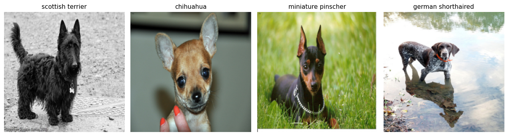
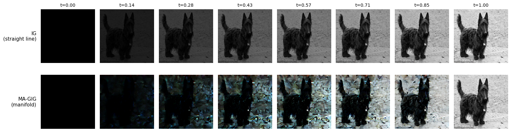
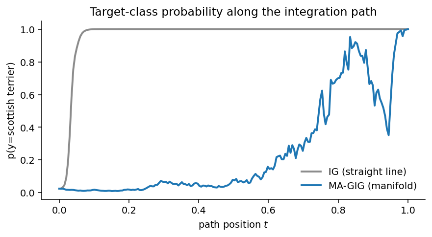
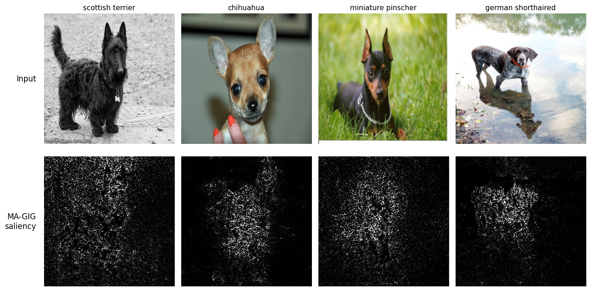
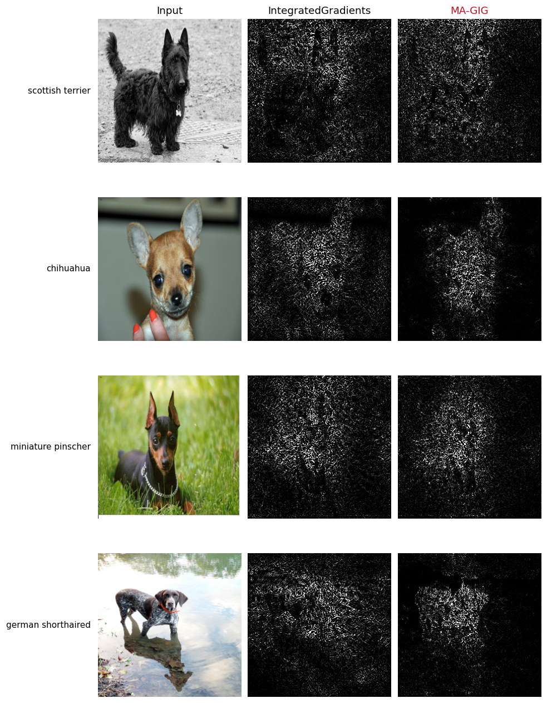
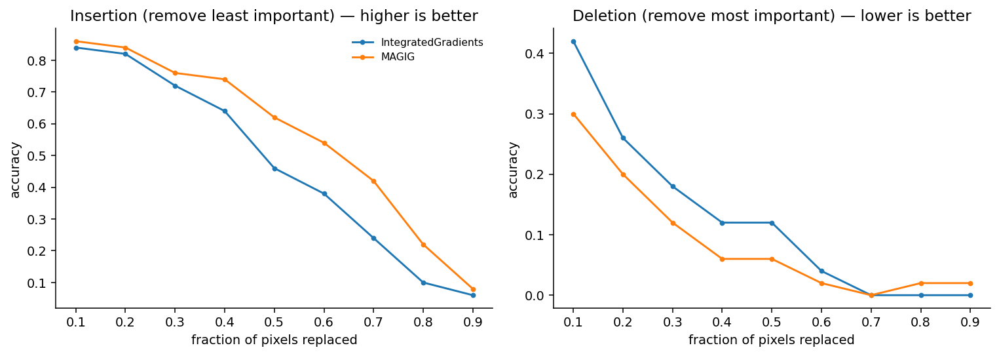
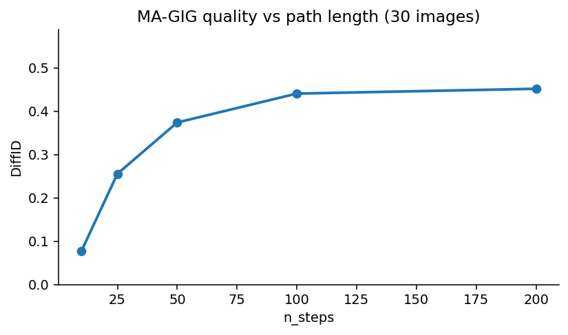

# Fine-Grained Image Classification with PnPXAI and MA-GIG

In this notebook we explain a fine-grained pet-breed classifier with **MA-GIG**
(Manifold-Aligned Guided Integrated Gradients), and compare it against
Integrated Gradients — the method it modifies.

**Contents:**
1. [Setup](#setup)
    - [Clone PnPXAI repository and install dependencies](#clone-install)
2. [Loading Data and Model](#data-model)
    - [Load the Oxford-IIIT Pet Dataset](#load-data)
    - [Load the Fine-Tuned ResNet-18](#load-model)
3. [Explanation Using PnPXAI](#explanation)
    - [Add the MA-GIG Explainer](#magig-explainer)
    - [Look at the Integration Path](#path)
    - [Generate Explanations](#generate-explanations)
4. [Visualization](#visualization)
    - [MA-GIG Attributions](#visualize-magig)
    - [Comparison Against Integrated Gradients](#visualize-all)
5. [Evaluation of Explanations](#evaluation)
    - [DiffID](#diffid)
    - [How Many Steps Does the Path Need?](#steps)
6. [Notes on Reproducibility](#repro)

Path-integral attribution methods all answer the same question — *how much did
each pixel contribute as the image was built up from a baseline?* — and they
differ only in the path they integrate along. This example shows what changes
when that path is required to look like real data.

## 1. Setup<a name="setup"></a>

First, we clone the PnPXAI repository and install the required dependencies.
MA-GIG integrates through a pretrained autoencoder, which comes from the
HuggingFace Hub, so `diffusers` is needed as well.

```python
!git clone --quiet https://github.com/OpenXAIProject/pnpxai
!pip install -q -e /content/pnpxai
!pip install -q diffusers scikit-learn

import sys
sys.path.append('/content/pnpxai')
```

The classifier checkpoints and the dataset used below come from the MA-GIG
paper's repository and its dataset mirror.

```python
# fine-tuned classifiers used in the paper
!git clone --quiet https://github.com/leekwoon/ma-gig
```

```python
# Oxford-IIIT Pet images
from huggingface_hub import snapshot_download

snapshot_download(
    'leekwoon/oxfordpet_dataset_backup',
    repo_type='dataset',
    local_dir='./oxfordpet_data',
)
```

```python
!cat ./oxfordpet_data/data.tar.gz.part_* | tar -xzf -
```

```python
import os
import numpy as np
import matplotlib.pyplot as plt
from PIL import Image
from sklearn.model_selection import train_test_split

import torch
import torch.nn as nn
import torchvision.models as models
from torch.utils.data import Dataset, DataLoader
from torchvision import transforms

from pnpxai import AutoExplanationForImageClassification
from pnpxai.explainers import MAGIG

torch.manual_seed(0)

# Required for MA-GIG to be repeatable — see section 6. Without it, two identical
# calls return visibly different attribution maps.
torch.backends.cudnn.deterministic = True
torch.backends.cudnn.benchmark = False

device = torch.device('cuda' if torch.cuda.is_available() else 'cpu')

MAGIG_REPO = './ma-gig'
DATA_PATH = './oxfordpet/images'
MEAN, STD = [0.485, 0.456, 0.406], [0.229, 0.224, 0.225]
IMAGE_SIZE, NUM_CLASSES = 256, 37
```

## 2. Loading Data and Model<a name="data-model"></a>

### 2.1 Load the Oxford-IIIT Pet Dataset<a name="load-data"></a>

The **Oxford-IIIT Pet** dataset contains ~7,390 photographs of 37 cat and dog
breeds, roughly 200 per breed. It is a fine-grained benchmark: telling a
Birman from a Ragdoll depends on small, localized cues, which makes it a useful
test of whether an attribution map points at anything meaningful.

The breed is encoded in the filename (`{breed}_{number}.jpg`). We reproduce the
train/validation split used in the MA-GIG paper's code so the numbers below line
up with the published setup.

```python
class OxfordPetDataset(Dataset):
    def __init__(self, root, transform=None, split='val', test_size=0.05, seed=42):
        files = sorted(f for f in os.listdir(root) if f.endswith('.jpg'))
        names = ['_'.join(f.split('_')[:-1]) for f in files]
        self.classes = sorted(set(names))
        c2i = {c: i for i, c in enumerate(self.classes)}
        tr_f, te_f, tr_n, te_n = train_test_split(
            files, names, test_size=test_size, random_state=seed)
        sel_f, sel_n = (te_f, te_n) if split == 'val' else (tr_f, tr_n)
        self.paths = [os.path.join(root, f) for f in sel_f]
        self.labels = [c2i[n] for n in sel_n]
        self.transform = transform

    def __len__(self):
        return len(self.paths)

    def __getitem__(self, i):
        img = Image.open(self.paths[i]).convert('RGB')
        return (self.transform(img) if self.transform else img), self.labels[i]

    def idx_to_label(self, i):
        return self.classes[i].replace('_', ' ')


transform = transforms.Compose([
    transforms.Resize((IMAGE_SIZE, IMAGE_SIZE)),
    transforms.ToTensor(),
    transforms.Normalize(MEAN, STD),
])
dataset = OxfordPetDataset(DATA_PATH, transform=transform, split='val')
print(f'validation images: {len(dataset)}, classes: {len(dataset.classes)}')
```

    validation images: 370, classes: 37

```python
def denormalize_image(x, mean=MEAN, std=STD):
    x = x.detach().cpu()
    out = x * torch.tensor(std)[:, None, None] + torch.tensor(mean)[:, None, None]
    return out.permute(1, 2, 0).clip(0, 1).numpy()


# four images from the benchmark subset used in section 5.1
VIS_IDX = [34, 40, 47, 49]
inputs = torch.stack([dataset[i][0] for i in VIS_IDX]).to(device)
labels = torch.tensor([dataset[i][1] for i in VIS_IDX]).to(device)

fig, axes = plt.subplots(1, 4, figsize=(12.8, 3.6))
for i in range(4):
    axes[i].imshow(denormalize_image(inputs[i]))
    axes[i].set_title(dataset.idx_to_label(labels[i].item()), fontsize=11)
    axes[i].axis('off')
plt.tight_layout()
plt.show()
```



These four are not the first four images of the split. They were picked from the
50 the benchmark in [section 5.1](#diffid) scores, as the ones where MA-GIG and
IG disagree most by per-image DiffID — all four happen to place the animal on
strongly textured ground, which is where the two methods visibly differ. Over the
whole 50, MA-GIG scores higher than IG on 31 and the median per-image gap is
+0.11, so the effect these images illustrate is typical in direction even though
they were chosen to make it legible.

### 2.2 Load the Fine-Tuned ResNet-18<a name="load-model"></a>

We use the ResNet-18 the MA-GIG authors fine-tuned on this dataset, shipped in
their repository under `checkpoints/classifier_oxfordpet/`. It is a plain
`torchvision` ResNet-18 with the final layer resized to 37 classes.

```python
def load_model():
    model = models.resnet18(weights=None)
    model.fc = nn.Identity()
    feat = model(torch.randn(1, 3, IMAGE_SIZE, IMAGE_SIZE)).view(-1).shape[0]
    model.fc = nn.Linear(feat, NUM_CLASSES)
    ckpt = torch.load(
        os.path.join(MAGIG_REPO, 'checkpoints/classifier_oxfordpet/resnet18_best.pt'),
        map_location='cpu', weights_only=False)
    model.load_state_dict(ckpt['model_state_dict'])
    return model.eval().to(device)


model = load_model()

correct = total = 0
with torch.no_grad():
    for xb, yb in DataLoader(dataset, batch_size=32):
        xb, yb = xb.to(device), yb.to(device)
        correct += (model(xb).argmax(-1) == yb).sum().item()
        total += yb.numel()
print(f'validation accuracy: {correct}/{total} = {correct / total:.4f}')
```

    validation accuracy: 358/370 = 0.9676

## 3. Explanation Using PnPXAI<a name="explanation"></a>

### 3.1 Add the MA-GIG Explainer<a name="magig-explainer"></a>

> **Manifold-Aligned Guided Integrated Gradients for Reliable Feature Attribution**<br>
> Soyeon Kim<sup>1, 3</sup>, Seongwoo Lim<sup>3</sup>, Kyowoon Lee<sup>2, \*</sup>, and Jaesik Choi<sup>1, 3, \*</sup><br/>
> (<sup>1</sup>Kim Jaechul Graduate School of AI, KAIST) <br/>
> (<sup>2</sup>KAIST InnoCORE LLM, KAIST) <br/>
> (<sup>3</sup>INEEJI) <br/>
> (\* indicates equal advising) <br/>
> Accepted to **ICML 2026** <br/>
> Paper: https://arxiv.org/abs/2605.02167 &nbsp;|&nbsp; Code: https://github.com/leekwoon/ma-gig

**The problem MA-GIG solves.** Integrated Gradients integrates along the straight
line from a baseline to the input. Every point on that line is a uniformly faded
version of the image — not something the classifier ever saw during training —
so the gradients being accumulated are read off out-of-distribution inputs.
Guided IG (GIG) improves on this by moving greedily: at each step it advances
only the features whose gradients are smallest, which avoids accumulating
high-variance gradients. But that update is *axis-aligned in pixel space*, and
the tangent space of natural images is not aligned with the pixel axes. The
paper formalizes this as **off-manifold drift**: each step leaves a
first-order error orthogonal to the manifold, while the manifold's curvature only
tolerates second-order deviation, so the errors accumulate along the path.

**What MA-GIG changes.** It runs the same greedy selection, but in the latent
space of a pretrained VAE. An axis-aligned step $\Delta z = \delta_j u_j$ in
latent space becomes

$$\Delta x \approx J_D(z)\,\Delta z = \delta_j \frac{\partial D}{\partial z_j}(z)$$

in pixel space — a column of the decoder Jacobian, which is by construction a
*tangent vector* to the manifold the decoder parameterizes. So the decoded path
moves along correlated, image-like directions instead of along pixel axes, and
the intermediate points stay close to plausible images.

Creating the explainer follows the usual PnPXAI interface. The autoencoder is
pulled from the HuggingFace Hub on first use:

```python
magig = MAGIG(
    model=model,
    n_steps=200,       # steps along the guided path
    fraction=0.05,     # move the 5% of latent dims with the smallest gradients
    use_slerp=True,    # interpolate latents along the arc, not the chord
    normalization_mean=MEAN,
    normalization_std=STD,
)
print(magig)
```

    MAGIG(n_steps=200, fraction=0.05, use_slerp=True, exp_obj=prob, normalization_mean=(0.485, 0.456, 0.406), normalization_std=(0.229, 0.224, 0.225), vae_repo=stabilityai/sd-vae-ft-mse, vae=VaeManifold(repo=stabilityai/sd-vae-ft-mse))

A few parameters are worth knowing about:

| Parameter | Meaning |
| --- | --- |
| `n_steps` | Number of points on the integration path. The greedy path needs far more steps than plain IG; the paper uses 200. |
| `fraction` | Quantile of gradient magnitude used as the selection threshold — the fraction of latent dimensions moved per step. |
| `use_slerp` | Move selected latents along the arc (spherical interpolation), which keeps the latent norm stable and the decoder in-distribution. |
| `baseline_fn` | Start of the path. Defaults to the black image, the baseline used in the paper; note this differs from PnPXAI's `'zeros'` default, which is zero in *normalized* space and decodes to mid-gray. Any PnPXAI `BaselineFunction` works, and the choice matters a lot — see [section 5.1](#diffid). |
| `normalization_mean` / `normalization_std` | How the classifier's inputs were normalized. MA-GIG needs this to hand pixels to the autoencoder. |
| `vae` / `vae_repo` | Autoencoder to integrate through. Defaults to `stabilityai/sd-vae-ft-mse`; pass your own `diffusers` autoencoder to override. |

### 3.2 Look at the Integration Path<a name="path"></a>

The path *is* the method, so it is worth looking at directly. `generate_path`
returns the images the attribution integrates over. Below we draw the straight
line from the *same* baseline MA-GIG starts from, so the only thing that differs
between the two rows is the path itself.

```python
path = magig.generate_path(inputs[:1], labels[:1])   # [n_steps, C, H, W]
baseline = magig.vae.normalize(torch.zeros_like(inputs[:1]))[0]
frames = np.linspace(0, path.shape[0] - 1, 8).astype(int)

# the straight line IG would have used, for comparison
straight = torch.stack([
    baseline + (inputs[0] - baseline) * (k / (path.shape[0] - 1)) for k in frames])

fig, axes = plt.subplots(2, len(frames), figsize=(2.0 * len(frames), 4.6))
for c, k in enumerate(frames):
    axes[0, c].imshow(denormalize_image(straight[c]))
    axes[1, c].imshow(denormalize_image(path[k]))
    axes[0, c].set_title(f't={k / (path.shape[0] - 1):.2f}', fontsize=10)
    for r in range(2):
        axes[r, c].axis('off')
for r, text in enumerate(['IG\n(straight line)', 'MA-GIG\n(manifold)']):
    axes[r, 0].text(-0.08, 0.5, text, transform=axes[r, 0].transAxes,
                    ha='right', va='center', fontsize=11)
plt.tight_layout()
plt.show()
```



The difference is visible without any metric. The top row is what IG integrates
over: the same photograph at eight brightness levels. Nothing in the training
distribution looks like a 30%-brightness dog, so the gradients IG accumulates in
the first half of its path are evaluated far from the data.

The bottom row is MA-GIG's path. Because it moves in latent space and decodes,
each intermediate frame is a picture the decoder considers plausible: the scene
assembles itself — background structure first, then coarse body shape, then the
face and fur texture — rather than fading in uniformly. Gradients are read off
images that resemble the ones the classifier was trained on.

This shows up in the classifier's own response along the path:

```python
with torch.no_grad():
    lin = torch.stack([
        baseline + (inputs[0] - baseline) * (k / (path.shape[0] - 1))
        for k in range(path.shape[0])])
    p_magig = torch.softmax(model(path), -1)[:, labels[0]].cpu().numpy()
    p_linear = torch.softmax(model(lin), -1)[:, labels[0]].cpu().numpy()

fig, ax = plt.subplots(figsize=(6.4, 3.6))
t = np.linspace(0, 1, path.shape[0])
ax.plot(t, p_linear, label='IG (straight line)', lw=2, color='#8c8c8c')
ax.plot(t, p_magig, label='MA-GIG (manifold)', lw=2, color='#1f77b4')
ax.set_xlabel('path position $t$')
ax.set_ylabel(f'p(y={dataset.idx_to_label(labels[0].item())})')
ax.legend(frameon=False)
ax.spines[['top', 'right']].set_visible(False)
plt.tight_layout()
plt.show()
```



Along the straight line the classifier is already certain by `t ≈ 0.2` and stays
pinned at 1.0 for the rest of the path. A saturated softmax has almost no
gradient, so roughly 80% of IG's integration contributes nothing but noise — the
saturation problem path methods are known for.

MA-GIG's path keeps the target class near zero until `t ≈ 0.7` and only then
climbs. The gradients that actually carry signal are concentrated where the image
is nearly the real one, which is the paper's own framing of why it works:
attributions aggregate "gradients on path features proximal to the input".

### 3.3 Generate Explanations<a name="generate-explanations"></a>

`AutoExplanationForImageClassification` inspects the model and assembles the
explainers that suit it. MA-GIG is added on top with `add_explainer`, the same
way the LEAR tutorial adds its explainer — it is not part of the automatic
recommendation because constructing it downloads an autoencoder.

```python
expr = AutoExplanationForImageClassification(
    model=model,
    data=DataLoader(dataset, batch_size=4, shuffle=False),
    input_extractor=lambda b: b[0].to(device),
    label_extractor=lambda b: b[-1].to(device),
    target_extractor=lambda o: o.argmax(-1).to(device),
    target_labels=False,  # target prediction if False
)
magig_id = expr.manager.add_explainer(magig)

names = [e.__class__.__name__ for e in expr.manager.explainers]
print(names)
```

    ['GradCam', 'Gradient', 'GradientXInput', 'GuidedGradCam', 'IntegratedGradients', 'KernelShap', 'LRPEpsilonAlpha2Beta1', 'LRPEpsilonGammaBox', 'LRPEpsilonPlus', 'LRPUniformEpsilon', 'Lime', 'RAP', 'SmoothGrad', 'VarGrad', 'MAGIG']

Everything from here on compares MA-GIG against **Integrated Gradients**, the
method it modifies. Since the only difference is the path, IG has to start from
the same place — the paper's black image, not PnPXAI's `'zeros'` default, which is
zero in *normalized* space and decodes to mid-gray. [Section 5.1](#diffid) shows
how much that choice is worth.

```python
from pnpxai.explainers import IntegratedGradients


class BlackImageBaseline:
    """The paper's baseline: zero in pixel space, not in normalized space."""
    def __init__(self, mean, std):
        self.mean, self.std = mean, std

    def __call__(self, inputs):
        zeros = torch.zeros_like(inputs)
        return torch.stack([(zeros[:, i] - m) / s
                            for i, (m, s) in enumerate(zip(self.mean, self.std))], dim=1)


explainers = {
    'IntegratedGradients': IntegratedGradients(
        model, n_steps=200, baseline_fn=BlackImageBaseline(MEAN, STD)),
    'MAGIG': magig,
}
postprocessor = expr.manager.get_postprocessor_by_id(0)
postprocessors = {name: postprocessor for name in explainers}

explanations = {}
for name, explainer in explainers.items():
    explanations[name] = explainer.attribute(inputs, labels).detach().cpu()
    print(f'{name}: {tuple(explanations[name].shape)}')
```

    IntegratedGradients: (4, 3, 256, 256)
    MAGIG: (4, 3, 256, 256)

## 4. Visualization<a name="visualization"></a>

Post-processed attribution maps are dominated by a handful of extreme pixels,
which renders as an almost blank image. We clip at the 99th percentile before
displaying — applied identically to every method, so the comparison stays fair.

```python
def for_display(heat, q=99.0):
    h = heat.detach().cpu().numpy()
    return np.clip(h / (np.percentile(h, q) + 1e-10), 0, 1)
```

### 4.1 MA-GIG Attributions<a name="visualize-magig"></a>

```python
fig, axes = plt.subplots(2, 4, figsize=(12.8, 6.6))
for i in range(4):
    heat = for_display(postprocessors['MAGIG'](explanations['MAGIG'][i][None].to(device))[0])
    axes[0, i].imshow(denormalize_image(inputs[i]))
    axes[0, i].set_title(dataset.idx_to_label(labels[i].item()), fontsize=11)
    axes[1, i].imshow(heat, cmap='gray')
    for r in range(2):
        axes[r, i].axis('off')
for r, text in enumerate(['Input', 'MA-GIG\nsaliency']):
    axes[r, 0].text(-0.06, 0.5, text, transform=axes[r, 0].transAxes,
                    ha='right', va='center', fontsize=12)
plt.tight_layout()
plt.show()
```



MA-GIG concentrates its attribution on the animal — chiefly the face and the
upper body, where the breed-discriminative markings are — and leaves the ground
and background largely unattributed. The maps are sparse and pixel-level rather
than blob-shaped: path-integral methods assign credit per pixel, so they do not
produce the smooth regions a CAM-style method does.

### 4.2 Comparison Against Integrated Gradients<a name="visualize-all"></a>

```python
fig, axes = plt.subplots(4, 3, figsize=(9, 12))
for r in range(4):
    axes[r, 0].imshow(denormalize_image(inputs[r]))
    axes[r, 0].axis('off')
    axes[r, 0].text(-0.05, 0.5, dataset.idx_to_label(labels[r].item()),
                    transform=axes[r, 0].transAxes, ha='right', va='center', fontsize=10)
    for c, name in enumerate(['IntegratedGradients', 'MAGIG'], start=1):
        heat = postprocessors[name](explanations[name][r][None].to(device))[0]
        axes[r, c].imshow(for_display(heat), cmap='gray')
        axes[r, c].axis('off')
for c, title in enumerate(['Input', 'IntegratedGradients', 'MA-GIG']):
    axes[0, c].set_title(title, fontsize=12)
plt.tight_layout()
plt.show()
```



The difference is where the two methods spend attribution that is *not* on the
animal. IG lights up the gravel, the grass, and the water reflection — high-
frequency background texture that has nothing to do with breed. MA-GIG leaves
most of it dark and keeps its mass on the dog. That is the behaviour the method
predicts: IG reads gradients off uniformly-dimmed images that the classifier
never saw, and texture is exactly where those off-manifold gradients fire.

## 5. Evaluation of Explanations<a name="evaluation"></a>

### 5.1 DiffID<a name="diffid"></a>

DiffID is the metric the MA-GIG paper reports. It perturbs pixels in
attribution order and measures what happens to accuracy:

- **Deletion** replaces the *highest*-attribution pixels with the mean of the
  remaining ones. A faithful map should make accuracy fall quickly.
- **Insertion** replaces the *lowest*-attribution pixels instead. A faithful map
  should leave accuracy largely intact.

`DiffID = insertion accuracy − deletion accuracy`, averaged over removal ratios;
higher is better. It rewards a map for being right about both which pixels
matter and which do not.

```python
def compute_diffid(model, images, attributions, labels,
                   ratios=(.1, .2, .3, .4, .5, .6, .7, .8, .9)):
    b = images.shape[0]
    n_pix = images[0].numel()
    flat_x = images.reshape(b, -1)
    flat_a = attributions.abs().reshape(b, -1)
    rows = torch.arange(b, device=images.device).unsqueeze(1)

    def accuracy_after(n_perturb, descending):
        idx = torch.argsort(flat_a, dim=1, descending=descending)[:, :n_perturb]
        keep = torch.ones_like(flat_x)
        keep[rows, idx] = 0
        fill = (flat_x * keep).sum(1, keepdim=True) / (keep.sum(1, keepdim=True) + 1e-8)
        out = flat_x.clone()
        out[rows, idx] = fill.expand_as(out)[rows, idx]
        with torch.no_grad():
            pred = model(out.view(images.shape)).argmax(1)
        return (pred == labels).float().mean().item()

    ins, dele = [], []
    for r in ratios:
        k = int(n_pix * r)
        dele.append(accuracy_after(k, descending=True))
        ins.append(accuracy_after(k, descending=False))
    return float(np.mean([i - d for i, d in zip(ins, dele)])), ins, dele
```

We evaluate on the first 50 validation images. This is the expensive cell — about
16 minutes on one RTX A6000, almost all of it MA-GIG at `n_steps=200`. Drop to 10
images if you only want to see it run; the ranking gets noisy below ~30 because
DiffID is accuracy-based and moves in steps of `1/n`.

```python
methods = list(explainers)   # IntegratedGradients and MAGIG, both from black
collected = {m: [] for m in methods}
imgs_all, labs_all = [], []

for n, (xb, yb) in enumerate(DataLoader(dataset, batch_size=1, shuffle=False)):
    if n >= 50:
        break
    xb, yb = xb.to(device), yb.to(device)
    imgs_all.append(xb)
    labs_all.append(yb)
    for m in methods:
        collected[m].append(explainers[m].attribute(xb, yb).detach())

imgs_all, labs_all = torch.cat(imgs_all), torch.cat(labs_all)

ratios = [.1, .2, .3, .4, .5, .6, .7, .8, .9]
fig, axes = plt.subplots(1, 2, figsize=(11, 4))
for m in methods:
    score, ins, dele = compute_diffid(model, imgs_all, torch.cat(collected[m]), labs_all)
    print(f'{m:<22} DiffID={score:.4f}')
    axes[0].plot(ratios, ins, marker='o', ms=3, label=m)
    axes[1].plot(ratios, dele, marker='o', ms=3, label=m)
axes[0].set_title('Insertion (remove least important) — higher is better')
axes[1].set_title('Deletion (remove most important) — lower is better')
for ax in axes:
    ax.set_xlabel('fraction of pixels replaced')
    ax.set_ylabel('accuracy')
    ax.spines[['top', 'right']].set_visible(False)
axes[0].legend(frameon=False, fontsize=8)
plt.tight_layout()
plt.show()
```

    IntegratedGradients    DiffID=0.3467
    MAGIG                  DiffID=0.4756



MA-GIG leads: **0.4756 against IG's 0.3467**, a gap of +0.129 that is in line with
the +0.085 the paper reports for this dataset and classifier.

**Fixing the baseline is not optional.** Had we left `IntegratedGradients` on
PnPXAI's image-modality default, its score would have been **0.4911** — above
MA-GIG's 0.4756, reversing the conclusion. That default is `'zeros'` — zero in
the *normalized* space, which denormalizes to mid-gray, not the black image the
paper starts from. Since IG attributes `grad · (x − x')`, a black baseline zeroes
out the contribution of already-dark pixels, and this dataset is full of black
dogs and cats. Sweeping the baseline for both methods on the same 50 images:

```python
from pnpxai.explainers.utils.baselines import (
    ZeroBaselineFunction, GaussianBlurBaselineFunction)

blur = GaussianBlurBaselineFunction(kernel_size_x=11, kernel_size_y=11,
                                    sigma_x=5.0, sigma_y=5.0)
for label, fn in [('black', BlackImageBaseline(MEAN, STD)),
                  ('zeros', ZeroBaselineFunction()), ('blur', blur)]:
    for name, explainer in [('IG', IntegratedGradients(model, n_steps=200, baseline_fn=fn)),
                            ('MA-GIG', MAGIG(model, n_steps=200, baseline_fn=fn,
                                             normalization_mean=MEAN, normalization_std=STD))]:
        attrs = torch.cat([explainer.attribute(imgs_all[i][None], labs_all[i][None]).detach()
                           for i in range(50)])
        score, _, _ = compute_diffid(model, imgs_all, attrs, labs_all)
        print(f'{name:<7} baseline={label:<6} DiffID={score:.4f}')
```

| Baseline | IG | MA-GIG | Gap |
| --- | ---: | ---: | ---: |
| black (the paper's) | 0.3467 | **0.4756** | +0.129 |
| zeros / mid-gray (PnPXAI default) | 0.4911 | **0.5533** | +0.062 |
| gaussian blur | 0.5644 | **0.6111** | +0.047 |

Two readings. MA-GIG wins at every baseline, so the paper's claim survives the
change of setting — but the baseline is a *larger* lever than the path: moving
either method from black to blur is worth more than swapping IG for MA-GIG at a
fixed baseline. If you care about absolute quality rather than about isolating
the path, tune the baseline first. `MAGIG` defaults to the paper's black image so
results match the published numbers, and takes any PnPXAI `BaselineFunction` when
you want to change that:

```python
from pnpxai.explainers.utils.baselines import GaussianBlurBaselineFunction

magig_blur = MAGIG(
    model=model, n_steps=200,
    baseline_fn=GaussianBlurBaselineFunction(kernel_size_x=11, kernel_size_y=11,
                                             sigma_x=5.0, sigma_y=5.0),
    normalization_mean=MEAN, normalization_std=STD,
)
```

### 5.2 How Many Steps Does the Path Need?<a name="steps"></a>

`n_steps` is the parameter that matters most. Each step moves only `fraction` of
the latent dimensions, so too few steps means each step moves too much at once
and the path stops resembling a guided walk. Sweeping it on 30 validation images
(about 20 minutes — the results are reported here so you need not run it):

```python
scores = []
for s in [10, 25, 50, 100, 200]:
    magig.n_steps = s
    attrs = torch.cat([magig.attribute(imgs_all[i][None], labs_all[i][None]).detach()
                       for i in range(30)])
    score, _, _ = compute_diffid(model, imgs_all[:30], attrs, labs_all[:30])
    scores.append(score)
    print(f'n_steps={s:>4}  DiffID={score:.4f}')
```

    n_steps=  10  DiffID=0.0778
    n_steps=  25  DiffID=0.2556
    n_steps=  50  DiffID=0.3741
    n_steps= 100  DiffID=0.4407
    n_steps= 200  DiffID=0.4519



Quality climbs steeply to about 100 steps and then flattens — the paper's 200 buys
little over 100 on this dataset, so halving the runtime is a reasonable trade.
What is *not* reasonable is going much lower. Ten steps is not a cheap version of
MA-GIG but a different, far worse method (0.08 versus 0.45): with `fraction=0.05`
a ten-step path has to cover the whole latent distance in ten moves and stops
resembling a guided walk at all. Treat `n_steps` below ~100 as a correctness
problem rather than a speed setting.

## 6. Notes on Reproducibility<a name="repro"></a>

**The autoencoder.** The paper's configuration uses the Stable Diffusion 2.1
autoencoder. `MAGIG` defaults to `stabilityai/sd-vae-ft-mse`, which publishes
bit-identical weights (verified: maximum absolute difference over all parameters
is exactly 0). To use a different one, pass a `diffusers` autoencoder directly:

```python
from diffusers import AutoencoderKL

vae = AutoencoderKL.from_pretrained('CompVis/stable-diffusion-v1-1', subfolder='vae')
magig = MAGIG(model=model, vae=vae.to(device))
```

**Set `cudnn.deterministic` — this one is not optional.** MA-GIG's greedy step
selects the latent dimensions whose gradient magnitudes fall under a low
quantile, and near that threshold the distribution is dense: for a 256×256 image
roughly 130 of the 4096 latent dimensions sit within `1e-7` of the threshold, and
the gap between the last selected dimension and the first rejected one is about
`7e-6` in relative terms. Any last-bit difference in an intermediate computation
flips which dimensions move, and the rest of the path goes elsewhere.

cuDNN's default algorithm selection is not bit-reproducible, and that is enough
to trigger it. Calling the explainer twice on the same image:

| | `generate_path` twice | `attribute` twice |
| --- | ---: | ---: |
| `cudnn.deterministic = False` (PyTorch default) | 7.29 | 6.8e-2 |
| `cudnn.deterministic = True` | **0.0** | **0.0** |

So under PyTorch's defaults MA-GIG returns a visibly different map every call.
The two lines in the setup cell above fix that, and the paper's own code sets the
same flag. The maps produced either way are equally valid — this is about being
able to reproduce a result, not about which one is right. (The stronger
`torch.use_deterministic_algorithms(True)` is *not* an option here: VGG-16 and
GoogLeNet use `adaptive_avg_pool2d`, whose backward has no deterministic CUDA
kernel, so it raises rather than helping. `cudnn.deterministic` is enough.)

With the flag set, repeated calls within one process were bit-identical for
ResNet-18 and GoogLeNet, and agreed to `2e-9` or better for VGG-16.
Reproducibility across *processes* still depends on the architecture. Taking the paper's own reference implementation at `n_steps=200`
and re-running it in a fresh process against its own saved output:

| Classifier | Reference impl. vs itself | This port vs reference impl. |
| --- | ---: | ---: |
| ResNet-18 | `0.0` (bit-identical) | `0.0` (bit-identical) |
| GoogLeNet | `0.0` (bit-identical) | `0.0` (bit-identical) |
| VGG-16 | `6.7e-2` (r = 0.78) | within that spread |

On VGG-16 two runs of *identical code* in separate processes correlate at only
0.78. cuDNN still has latitude in kernel choice across processes, and MA-GIG
amplifies the resulting last-bit differences into a different path. That is a
property of the method, not of any one implementation.

One more consequence: **comparing implementations requires matching arithmetic,
not just formulas.** Writing the input normalization as a broadcast divide
instead of a per-channel scalar divide changes results in the last bits (`~2e-6`)
and thereby changes the path entirely. `MAGIG` uses the per-channel form, which
is what makes the ResNet-18 and GoogLeNet columns above come out at zero.

If you need runs you can diff, fix the classifier, the GPU, and the library
versions — and prefer architectures whose backward pass is reproducible. If you
only need a faithful explanation, none of this matters.

**Cost.** The path is sequential and decodes once per step, so runtime scales
linearly in `n_steps` — about 20 s per 256×256 image at `n_steps=200` on an
RTX A6000. Samples in a batch are processed one at a time to bound memory.
Lowering `n_steps` speeds things up proportionally, at the quality cost measured
in [section 5.2](#steps).

## Citation

```bibtex
@inproceedings{kim2026manifoldaligned,
  title     = {Manifold-Aligned Guided Integrated Gradients for Reliable Feature Attribution},
  author    = {Kim, Soyeon and Lim, Seongwoo and Lee, Kyowoon and Choi, Jaesik},
  booktitle = {International Conference on Machine Learning (ICML)},
  year      = {2026},
  url       = {https://arxiv.org/abs/2605.02167},
}
```
